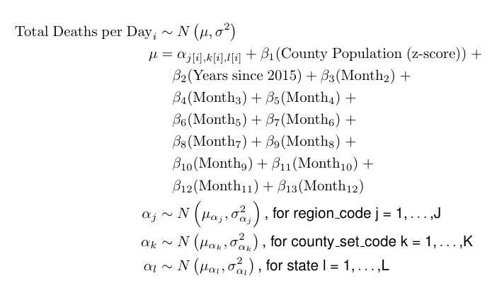

COVID-19 United States Excess Deaths by county and quarter
================

<!-- README.md is generated from README.Rmd. Please edit that file -->

# Overview

This repository contains code and data to estimate **expected deaths**
and **excess deaths** in the United States in 2020 and 2021 by
**county** and **quarter**. This model estimates that there were about
411714 excess deaths in the United States in 2020 and 138509 in the
first two quarters of 2021, for a total of 550223.

Estimated excess deaths are available at
[`/blob/main/results/united_states_county_quarterly_excess_deaths_estimates.csv`](https://github.com/mymil/covid-19-united-states-county-quarterly-excess-deaths/blob/main/results/united_states_county_quarterly_excess_deaths_estimates.csv).

#### Nationwide United States Mortality, 2015 through June 2021

<!-- -->

Excess mortality for the quarters in which total deaths exceeded
expected deaths are highlighted in blue.

# Data Sources

-   CDC WONDER all-cause, all-ages deaths by county and month

    <https://wonder.cdc.gov/ucd-icd10.html>

    These public-use historical mortality data were obtained for years
    2015-2019 and used to estimate the expected deaths model. Because
    these data have an unusual and specific license, they are not
    included as part of the repository, but can be freely downloaded
    from <https://wonder.cdc.gov/ucd-icd10.html>.

    Note: County-months wither fewer than 10 deaths are censored in the
    source data.

-   NCHS Provisional COVID-19 Deaths by Quarter and County

    <https://data.cdc.gov/NCHS/AH-Provisional-COVID-19-Death-Counts-by-Quarter-an/dnhi-s2bf>

    These public domain all-cause and COVID-19 mortality data were
    obtained for 2020-2021 and compared to estimated expected deaths to
    calculate excess deaths.

    Note: Values for county-quarters with fewer than 9 deaths are
    suppressed in these data.

-   US Census Population Estimates

    Population estimates for 2015-2020 were retrieved from the [US
    Census Bureau Population
    Estimates](https://www.census.gov/programs-surveys/popest/technical-documentation/research/evaluation-estimates/2020-evaluation-estimates/2010s-counties-total.html),
    because these data are not yet included in the Census Bureau Data
    API. 2020 population estimates were used for 2021.

    Note: This product uses Census Bureau data but is not endorsed or
    certified by the Census Bureau.

# Excess Deaths Model

The excess deaths model used began as an adaptation of *The Economist*’s
[excess mortality
model](https://github.com/TheEconomist/covid-19-excess-deaths-tracker),
but has since diverged. For details on model selection and performance,
see
[`/blob/main/results/README.md`](https://github.com/mymil/covid-19-united-states-county-quarterly-excess-deaths/blob/main/results/README.md).

Given the large number of counties in the United States (over 3000), a
linear mixed model with county, county set, and census division as
random grouping factors was used to make estimation tractable. These
random grouping factors enable each county, county set, and state to
have their own intercepts in the final model.

More precisely, **total deaths per day** was regressed on:

-   county population (z-scored)

-   years since 2015

-   quarter of the year (fixed grouping factor)

-   county (random grouping factor nested within county set)

-   county set (random grouping factor nested within state)

-   state (random grouping factor)

This model can be expressed by the equation:



The model object is available at
[`/blob/main/results/united_states_county_quarterly_model.RDS`](https://github.com/mymil/covid-19-united-states-county-quarterly-excess-deaths/blob/main/results/united_states_county_quarterly_model.RDS).

The model estimates for each observation, including fitted values and
residuals, are available at
[`/blob/main/results/united_states_county_quarterly_fitted_deaths_per_day_estimate.csv`](https://github.com/mymil/covid-19-united-states-county-quarterly-excess-deaths/blob/main/results/united_states_county_quarterly_fitted_deaths_per_day_estimate.csv).
Note that these estimates are only y-hat directly from the initial
model, **not** predicted values on the full dataset, which are
[available
here](https://github.com/mymil/covid-19-united-states-county-quarterly-excess-deaths/blob/main/results/united_states_county_quarterly_excess_deaths_estimates.csv)..

# Model Performance

For more details on model selection and performance, see
[`/blob/main/results/README.md`](https://github.com/mymil/covid-19-united-states-county-quarterly-excess-deaths/blob/main/results/README.md).

Because the COVID-19 pandemic only began in the United States partway
through March, 2020, we can evaluate model performance by examining
concordance of predicted and observed deaths in Q1 2020.

Observed and expected deaths in Q1 2020 are highly correlated, r =
0.998. As can be seen from the following scatterplot, total deaths
(x-axis) tended to exceed expected deaths (y-axis). Unsurprisingly, some
of the counties that were hardest hit early in the pandemic are among
those with total deaths that most diverge from expected deaths.

<!-- -->

# Repository Organization

-   Excess deaths estimates and fitted LMM are available in `/results/`.

-   Code to fit the model and estimate excess deaths are available in
    `/code/`.

-   Data used in modeling are available in `/data/`, when possible.

# License

The code contained in this repository are available under the [MIT
License](https://opensource.org/licenses/MIT), and the data generated by
this code are licensed under the [Creative Commons Attribution 4.0
International License](https://creativecommons.org/licenses/by/4.0/).

``` r
sessionInfo()
## R version 4.0.4 (2021-02-15)
## Platform: x86_64-w64-mingw32/x64 (64-bit)
## Running under: Windows 10 x64 (build 19042)
## 
## Matrix products: default
## 
## locale:
## [1] LC_COLLATE=English_United States.1252 
## [2] LC_CTYPE=English_United States.1252   
## [3] LC_MONETARY=English_United States.1252
## [4] LC_NUMERIC=C                          
## [5] LC_TIME=English_United States.1252    
## 
## attached base packages:
## [1] stats     graphics  grDevices utils     datasets  methods   base     
## 
## other attached packages:
##  [1] lmerTest_3.1-3          lme4_1.1-27.1           Matrix_1.3-2           
##  [4] texPreview_1.5          tinytex_0.34            knitr_1.31             
##  [7] equatiomatic_0.3.0.9000 lubridate_1.7.10        data.table_1.14.2      
## [10] ggh4x_0.2.0             forcats_0.5.1           stringr_1.4.0          
## [13] dplyr_1.0.5             purrr_0.3.4             readr_2.0.2            
## [16] tidyr_1.1.3             tibble_3.1.0            ggplot2_3.3.5          
## [19] tidyverse_1.3.1        
## 
## loaded via a namespace (and not attached):
##  [1] rdocsyntax_0.4.1.9000 minqa_1.2.4           colorspace_2.0-0     
##  [4] ellipsis_0.3.1        rprojroot_2.0.2       base64enc_0.1-3      
##  [7] fs_1.5.0              rstudioapi_0.13       farver_2.1.0         
## [10] ggrepel_0.9.1         fansi_0.4.2           xml2_1.3.2           
## [13] splines_4.0.4         cachem_1.0.4          jsonlite_1.7.2       
## [16] nloptr_1.2.2.2        broom_0.7.9           dbplyr_2.1.1         
## [19] png_0.1-7             broom.mixed_0.2.6     shiny_1.6.0          
## [22] clipr_0.7.1           compiler_4.0.4        httr_1.4.2           
## [25] backports_1.2.1       assertthat_0.2.1      fastmap_1.1.0        
## [28] cli_3.0.1             svgPanZoom_0.3.4      later_1.2.0          
## [31] htmltools_0.5.1.1     tools_4.0.4           coda_0.19-4          
## [34] gtable_0.3.0          glue_1.4.2            reshape2_1.4.4       
## [37] V8_3.4.0              Rcpp_1.0.7            cellranger_1.1.0     
## [40] vctrs_0.3.7           pdftools_2.3.1        nlme_3.1-152         
## [43] xfun_0.26             rvest_1.0.0           mime_0.10            
## [46] lifecycle_1.0.0       MASS_7.3-53           scales_1.1.1         
## [49] hms_1.0.0             promises_1.2.0.1      rematch2_2.1.2       
## [52] TMB_1.7.20            yaml_2.2.1            curl_4.3             
## [55] memoise_2.0.0         stringi_1.5.3         highr_0.8            
## [58] desc_1.3.0            boot_1.3-26           rlang_0.4.10         
## [61] pkgconfig_2.0.3       evaluate_0.14         lattice_0.20-41      
## [64] labeling_0.4.2        tidyselect_1.1.0      here_1.0.1           
## [67] plyr_1.8.6            magrittr_2.0.1        R6_2.5.0             
## [70] magick_2.7.3          generics_0.1.0        DBI_1.1.1            
## [73] pillar_1.6.0          haven_2.3.1           whisker_0.4          
## [76] withr_2.4.2           mgcv_1.8-33           modelr_0.1.8         
## [79] crayon_1.4.1          utf8_1.2.1            tzdb_0.1.2           
## [82] rmarkdown_2.7         grid_4.0.4            readxl_1.3.1         
## [85] qpdf_1.1              reprex_2.0.0          digest_0.6.27        
## [88] xtable_1.8-4          httpuv_1.6.0          numDeriv_2016.8-1.1  
## [91] details_0.2.1         munsell_0.5.0         viridisLite_0.4.0    
## [94] askpass_1.1
```
