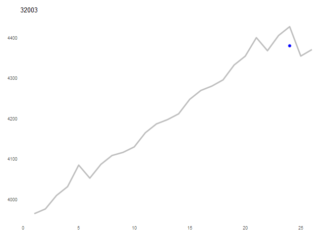

COVID-19 United States Excess Deaths by county and quarter: Model
comparison and selection
================

<!-- modeling_and_model_selection.md is generated from modeling_and_model_selection.Rmd. Please edit that file -->

# Model comparison strategy

Several models with alternate specifications of random grouping factors
were evaluated. To select a model, they were compared in terms of:

1.  Performance on 2015-2019 training data

2.  Performance on Q1 2020 data

3.  Outlier estimates in training data

# Intraclass correlations

First, we examined the intraclass correlation coefficients for each
specification to evaluate their reasonableness.

| Var         |  Sigma |   ICC |
|:------------|-------:|------:|
| region_code | 51.206 | 0.973 |
| quarter     |  0.027 | 0.001 |
| Residual    |  1.393 | 0.026 |

| Var             |  Sigma |   ICC |
|:----------------|-------:|------:|
| region_code     |  2.792 | 0.033 |
| county_set_code | 80.906 | 0.951 |
| quarter         |  0.027 | 0.000 |
| Residual        |  1.392 | 0.016 |

| Var             |  Sigma |   ICC |
|:----------------|-------:|------:|
| region_code     | 48.363 | 0.879 |
| census_division |  5.259 | 0.096 |
| quarter         |  0.027 | 0.000 |
| Residual        |  1.393 | 0.025 |

| Var           |  Sigma |   ICC |
|:--------------|-------:|------:|
| region_code   | 49.428 | 0.896 |
| census_region |  4.329 | 0.078 |
| quarter       |  0.027 | 0.000 |
| Residual      |  1.393 | 0.025 |

| Var             |  Sigma |   ICC |
|:----------------|-------:|------:|
| region_code     |  2.794 | 0.032 |
| county_set_code | 76.643 | 0.879 |
| census_division |  6.358 | 0.073 |
| quarter         |  0.027 | 0.000 |
| Residual        |  1.392 | 0.016 |

| Var             |  Sigma |   ICC |
|:----------------|-------:|------:|
| region_code     |  2.793 | 0.032 |
| county_set_code | 78.246 | 0.897 |
| census_region   |  4.770 | 0.055 |
| quarter         |  0.027 | 0.000 |
| Residual        |  1.392 | 0.016 |

\[\[1\]\] NULL

\[\[2\]\] NULL

\[\[3\]\] NULL

\[\[4\]\] NULL

\[\[5\]\] NULL

\[\[6\]\] NULL

# Model specifications

``` r
# set LMM control options
strictControl <- lmerControl(optCtrl = list(
  algorithm = "NLOPT_LN_NELDERMEAD",
  xtol_abs = 1e-12,
  ftol_abs = 1e-12
)
)

# Specify competing formulas for lmm with different nesting structures
# NOTE: lme4::lmer() does not require nested random grouping factor syntax
lmm_formulas <- list(
  as.formula(
    glue::glue(
      "total_deaths_per_day ~ 1 +
      population_z +
      year_zero +
      quarter +
      (1 | region_code)"
    )
  ),
  as.formula(
    glue::glue(
      "total_deaths_per_day ~ 1 +
      population_z +
      year_zero +
      quarter +
      (1 | region_code) +
      (1 | county_set_code)"
    )
  ),
  as.formula(
    glue::glue(
      "total_deaths_per_day ~ 1 +
      population_z +
      year_zero +
      quarter +
      (1 | region_code) +
      (1 | census_division)"
    )
  ),
  as.formula(
    glue::glue(
      "total_deaths_per_day ~ 1 +
      population_z +
      year_zero +
      quarter +
      (1 | region_code) +
      (1 | census_region)"
    )
  ),
  as.formula(
    glue::glue(
      "total_deaths_per_day ~ 1 +
      population_z +
      year_zero +
      quarter +
      (1 | region_code) +
      (1 | county_set_code) +
      (1 | census_division)"
    )
  ),
  as.formula(
    glue::glue(
      "total_deaths_per_day ~ 1 +
      population_z +
      year_zero +
      quarter +
      (1 | region_code) +
      (1 | county_set_code) +
      (1 | census_region)"
    )
  )
)

# run all models
model_out <- lmm_formulas %>%
  furrr::future_map(
    .,
    ~ estimate_excess_deaths(
      df = united_states_county_quarterly_deaths,
      expected_deaths_formula = .x,
      period = "quarter",
      calculate = TRUE,
      train_model = TRUE
    )
  )
```

# Performance on 2015-2019 training data

Compare model performance indices for all five models. By these metrics,
model 5 (counties nested within county sets nested within census
divisions) appears to perform the best.

| Name    | Model           |   AIC | AIC_wt |   BIC | BIC_wt | R2_conditional | R2_marginal |   ICC |  RMSE | Sigma |
|:--------|:----------------|------:|-------:|------:|-------:|---------------:|------------:|------:|------:|------:|
| Model 1 | lmerModLmerTest | 78174 |      0 | 78244 |      0 |          0.995 |       0.960 | 0.887 | 0.494 | 0.509 |
| Model 2 | lmerModLmerTest | 76762 |      0 | 76841 |      0 |          0.996 |       0.941 | 0.927 | 0.494 | 0.508 |
| Model 3 | lmerModLmerTest | 78079 |      0 | 78157 |      0 |          0.995 |       0.958 | 0.890 | 0.494 | 0.509 |
| Model 4 | lmerModLmerTest | 78105 |      0 | 78183 |      0 |          0.995 |       0.958 | 0.892 | 0.494 | 0.509 |
| Model 5 | lmerModLmerTest | 76706 |      1 | 76793 |      1 |          0.996 |       0.940 | 0.928 | 0.494 | 0.508 |
| Model 6 | lmerModLmerTest | 76725 |      0 | 76812 |      0 |          0.996 |       0.939 | 0.929 | 0.494 | 0.508 |

Model Performance

# Performance on Q1 2020 data

Compare mean squared error (MSE) of model-predicted death rates against
observed death rates in Q1 2020. Because the COVID-19 pandemic only
began partway through March, 2020, we can evaluate model performance by
examining concordance of predicted and observed deaths in Q1 2020. Model
5 has the best MSE.

<table class="kable_wrapper">
<caption>
Mean Squared Error of Alternate Models
</caption>
<tbody>
<tr>
<td>

|     x |
|------:|
| 10458 |

</td>
<td>

|     x |
|------:|
| 10385 |

</td>
<td>

|     x |
|------:|
| 10416 |

</td>
<td>

|     x |
|------:|
| 10444 |

</td>
<td>

|     x |
|------:|
| 10379 |

</td>
<td>

|     x |
|------:|
| 10380 |

</td>
</tr>
</tbody>
</table>

# Outlier estimates

To evaluate the extent of outlier model predictions, including
unexpectedly large changes quarter-to-quarter, time series outliers were
identified using `tsoutliers()` from the
{[forecast](https://cran.r-project.org/package=forecast)} R package.
Identified in this way, no models have any county-quarter outliers.

<table class="kable_wrapper">
<caption>
Summary of Model Outliers
</caption>
<tbody>
<tr>
<td>

| outlier_regions | outlier_total |
|----------------:|--------------:|
|               0 |             0 |

</td>
<td>

| outlier_regions | outlier_total |
|----------------:|--------------:|
|               0 |             0 |

</td>
<td>

| outlier_regions | outlier_total |
|----------------:|--------------:|
|               0 |             0 |

</td>
<td>

| outlier_regions | outlier_total |
|----------------:|--------------:|
|               0 |             0 |

</td>
<td>

| outlier_regions | outlier_total |
|----------------:|--------------:|
|               0 |             0 |

</td>
<td>

| outlier_regions | outlier_total |
|----------------:|--------------:|
|               0 |             0 |

</td>
</tr>
</tbody>
</table>
<!--


<!-- -->

    ## Error in unit(rep(0, TABLE_COLS * dims[2]), "null") : 
    ##   'x' and 'units' must have length > 0

–>

``` r
sessionInfo()
## R version 4.0.4 (2021-02-15)
## Platform: x86_64-w64-mingw32/x64 (64-bit)
## Running under: Windows 10 x64 (build 19042)
## 
## Matrix products: default
## 
## locale:
## [1] LC_COLLATE=English_United States.1252 
## [2] LC_CTYPE=English_United States.1252   
## [3] LC_MONETARY=English_United States.1252
## [4] LC_NUMERIC=C                          
## [5] LC_TIME=English_United States.1252    
## 
## attached base packages:
## [1] stats     graphics  grDevices utils     datasets  methods   base     
## 
## other attached packages:
##  [1] knitr_1.31        lme4_1.1-26       Matrix_1.3-2      aweek_1.0.2      
##  [5] lubridate_1.7.10  data.table_1.14.0 tidycensus_0.11.4 furrr_0.2.2      
##  [9] future_1.21.0     forcats_0.5.1     stringr_1.4.0     dplyr_1.0.5      
## [13] purrr_0.3.4       readr_2.0.2       tidyr_1.1.3       tibble_3.1.0     
## [17] ggplot2_3.3.5     tidyverse_1.3.1  
## 
## loaded via a namespace (and not attached):
##   [1] utf8_1.2.1            rms_6.2-0             tidyselect_1.1.0     
##   [4] htmlwidgets_1.5.3     grid_4.0.4            maptools_1.1-1       
##   [7] munsell_0.5.0         codetools_0.2-18      units_0.7-2          
##  [10] statmod_1.4.35        withr_2.4.2           colorspace_2.0-0     
##  [13] highr_0.8             uuid_0.1-4            rstudioapi_0.13      
##  [16] stats4_4.0.4          robustbase_0.93-7     ggsignif_0.6.1       
##  [19] TTR_0.24.2            listenv_0.8.0         emmeans_1.5.5-1      
##  [22] mnormt_2.0.2          rprojroot_2.0.2       coda_0.19-4          
##  [25] parallelly_1.24.0     vctrs_0.3.7           generics_0.1.0       
##  [28] TH.data_1.0-10        xfun_0.26             ggthemes_4.2.4       
##  [31] R6_2.5.0              VGAM_1.1-5            cachem_1.0.4         
##  [34] assertthat_0.2.1      scales_1.1.1          forecast_8.15        
##  [37] multcomp_1.4-16       nnet_7.3-15           gtable_0.3.0         
##  [40] multcompView_0.1-8    globals_0.14.0        conquer_1.0.2        
##  [43] sandwich_3.0-0        timeDate_3043.102     rlang_0.4.10         
##  [46] MatrixModels_0.5-0    splines_4.0.4         rstatix_0.7.0        
##  [49] rgdal_1.5-23          TMB_1.7.20            broom_0.7.6          
##  [52] checkmate_2.0.0       reshape2_1.4.4        yaml_2.2.1           
##  [55] abind_1.4-5           modelr_0.1.8          backports_1.2.1      
##  [58] quantmod_0.4.18       Hmisc_4.5-0           tools_4.0.4          
##  [61] psych_2.1.3           lavaan_0.6-8          ellipsis_0.3.1       
##  [64] RColorBrewer_1.1-2    proxy_0.4-26          extraoperators_0.1.1 
##  [67] tigris_1.5            Rcpp_1.0.7            plyr_1.8.6           
##  [70] base64enc_0.1-3       classInt_0.4-3        ggpubr_0.4.0         
##  [73] rpart_4.1-15          fracdiff_1.5-1        cowplot_1.1.1        
##  [76] zoo_1.8-9             haven_2.3.1           cluster_2.1.0        
##  [79] fs_1.5.0              here_1.0.1            magrittr_2.0.1       
##  [82] openxlsx_4.2.3        lmerTest_3.1-3        SparseM_1.81         
##  [85] lmtest_0.9-38         reprex_2.0.0          tmvnsim_1.0-2        
##  [88] mvtnorm_1.1-1         matrixStats_0.58.0    patchwork_1.1.1      
##  [91] hms_1.0.0             evaluate_0.14         xtable_1.8-4         
##  [94] rio_0.5.26            jpeg_0.1-8.1          JWileymisc_1.2.0     
##  [97] broom.mixed_0.2.6     readxl_1.3.1          gridExtra_2.3        
## [100] compiler_4.0.4        mice_3.13.0           KernSmooth_2.23-18   
## [103] V8_3.4.0              crayon_1.4.1          minqa_1.2.4          
## [106] htmltools_0.5.1.1     mgcv_1.8-33           tzdb_0.1.2           
## [109] multilevelTools_0.1.1 Formula_1.2-4         rdocsyntax_0.4.1.9000
## [112] DBI_1.1.1             dbplyr_2.1.1          MASS_7.3-53          
## [115] rappdirs_0.3.3        sf_1.0-2              boot_1.3-26          
## [118] car_3.0-10            cli_2.5.0             quadprog_1.5-8       
## [121] insight_0.14.4.1      parallel_4.0.4        pkgconfig_2.0.3      
## [124] numDeriv_2016.8-1.1   foreign_0.8-81        sp_1.4-5             
## [127] xml2_1.3.2            pbivnorm_0.6.0        estimability_1.3     
## [130] rvest_1.0.0           digest_0.6.27         rmarkdown_2.7        
## [133] cellranger_1.1.0      htmlTable_2.1.0       curl_4.3             
## [136] urca_1.3-0            quantreg_5.85         nloptr_1.2.2.2       
## [139] tseries_0.10-48       lifecycle_1.0.0       nlme_3.1-152         
## [142] jsonlite_1.7.2        carData_3.0-4         fansi_0.4.2          
## [145] pillar_1.6.0          lattice_0.20-41       fastmap_1.1.0        
## [148] httr_1.4.2            DEoptimR_1.0-8        survival_3.2-7       
## [151] xts_0.12.1            glue_1.4.2            zip_2.1.1            
## [154] png_0.1-7             performance_0.7.3.5   class_7.3-18         
## [157] stringi_1.5.3         polspline_1.1.19      latticeExtra_0.6-29  
## [160] memoise_2.0.0         e1071_1.7-9
```
